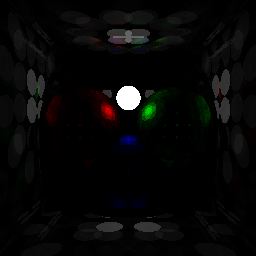

# pathtracer

A simple pathtracer implementation to learn rust, written without any external dependencies.

In it's current form it renders a hard coded scene and stores the result in the file `test.ppm`.

To run the pathtracer execute:

	cargo run

Note: path tracing is slow, so give it a moment.

## References
* The design of this pathtracer is inspired by the [pbrt](http://www.pbr-book.org/)
* A general introduction on rust is in the [rust book](https://doc.rust-lang.org/book/)
